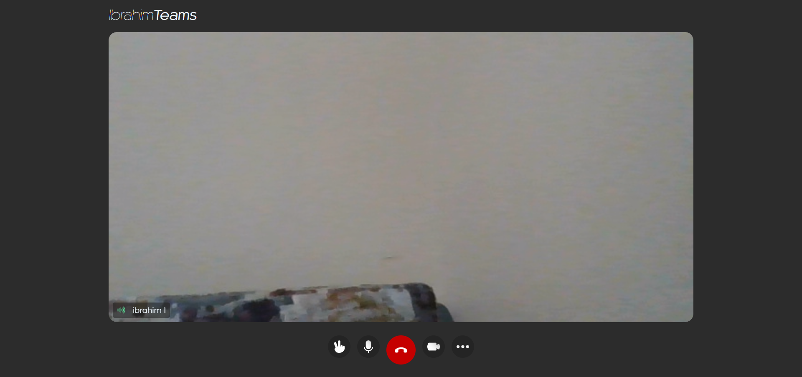
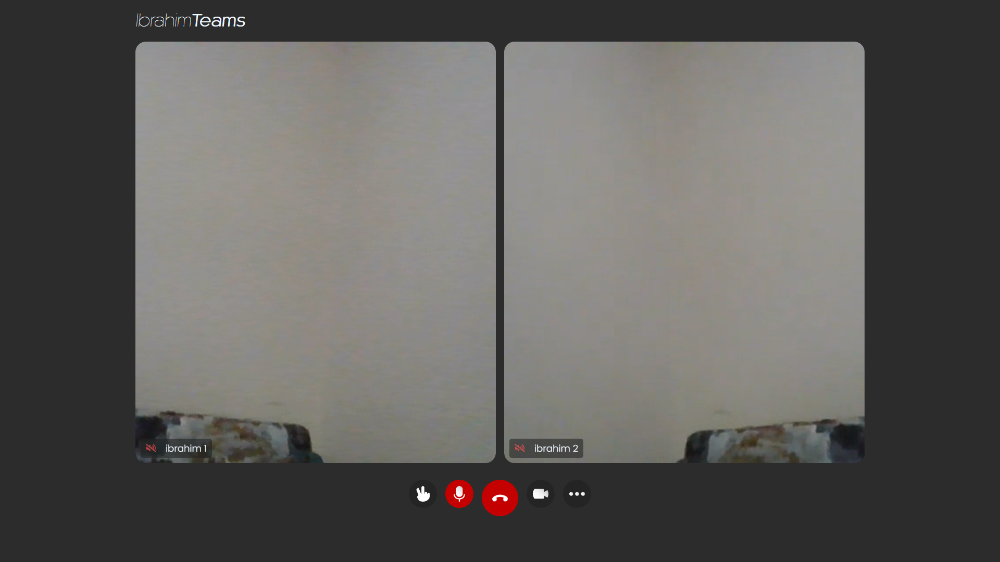

# Video Call Application

- [Description](#description)
- [Used Approach & Solution Architecture](#approach)
- [What is ELectron](#electron)
- [Results](#results)
- [Run The Program](#run)

## Description

Simple video call desktop application that you enables you to join by many users and mute/unmute
your mic, open/close your camera. the call started by the host and the other peers (users) can join.
it is required that the host can change users background (not implemented)


## Approach
The solution is a web application wrapped in ElectronJS app to be hosted by any free service, it is created using:
- ElectronJS Framework
- HTML
- CSS
- JavaScript

Too many approaches was though of but this will be platform friendly, and operates in different operating systems like Windows, MacOS or Linux
This makes it a cross-platform application with one source code to edit.

This solution architecture of ElectronJS based app is recommended primarily for how easy JavaScript can deal with network things
and easily deal with APIs and availability of resources to support our solution.

Agora APIs was used to make the real time connections, it is built on top of Web RTC, it has a SDK for enabling 
real-time audio and video communications.

## Electron

Electron is a framework for building desktop applications using JavaScript, HTML, and CSS. By embedding Chromium and Node.js into its binary, Electron allows you to maintain one JavaScript codebase and create cross-platform apps that work on Windows, macOS, and Linux — no native development experience required.

## Results
Results was quit acceptable 

Some of the application snapshots





## Run 

You need to install NodeJS on your computer.

[Download NodeJS](https://nodejs.org/en/download/)

Go the folder of the app and run
```Javascript
npm install
npm start
```
