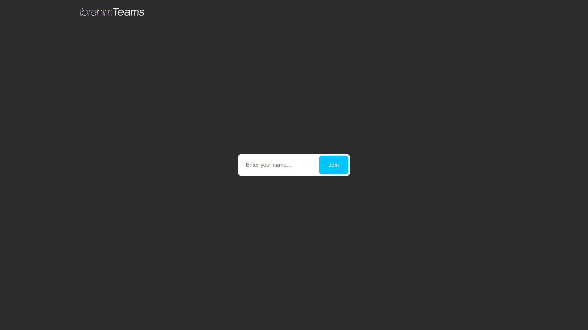
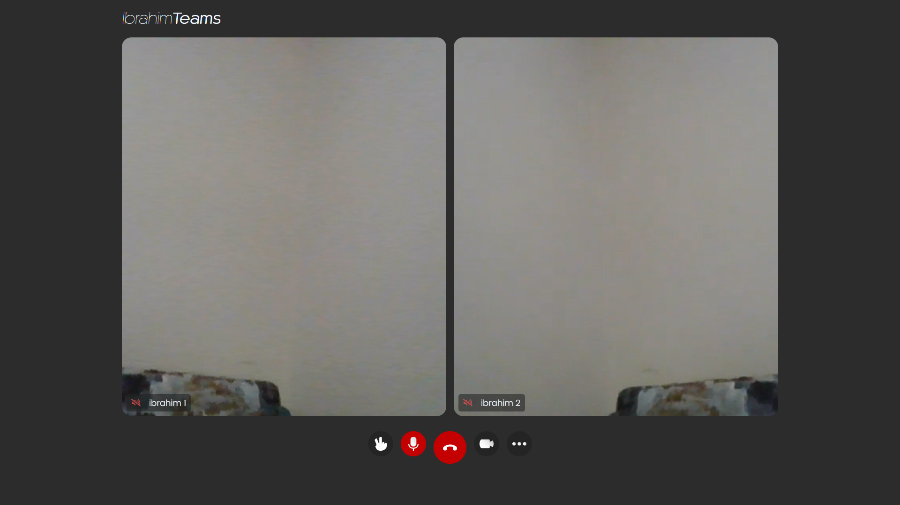

# Video Call Application

- [Description](#description)
- [Used Approach & Solution Architecture](#approach)
- [Results]()
- [Comments & Conclusions]()
- [Time Report]()

## Description

Simple video call application that you enables you to join by many users and mute/unmute
your mic, open/close your camera. the call started by the host and the other peers (users) can join.
it is required that the host can change users background (not implemented)

## Approach
The solution is a web application to be hosted by any free service, it is created using:
- HTML
- CSS
- JavaScript

Too many approaches was though of but this will be platform friendly, and it can be wrapped later in an electronJS application
to be a cross-platform application with one source code to edit.

This solution architecture of web based app is recommended primarily for how easy JavaScript can deal with network things
and easily deal with APIs and availability of resources to support our solution.

Agora APIs was used to make the real time connections, it is built on top of Web RTC, it has a SDK for enabling 
real-time audio and video communications.

### Results
Results was quit acceptable for me as it is the first time doing video call or dealing with RTC
and here are some snippits for what I have reached.

### Comments & Conclusions
My Comments and recommendations is that this kind of applications needs more time to be built. a raise hand could be implemented alongside
the host-controlled virtual background. we may need to see more 

### Time Report

The most time taken was to:
- Search on how to implement the task (2 ~ 3 hrs)
- Search for a suitable development language and framework (~1.5 hrs)
- Learn Electron  (4 hrs)
- Learn and read Agora Documentation (5 hrs)
- Design the user interface (3 hrs)
- Implement the logic (5 ~ 8 hrs)